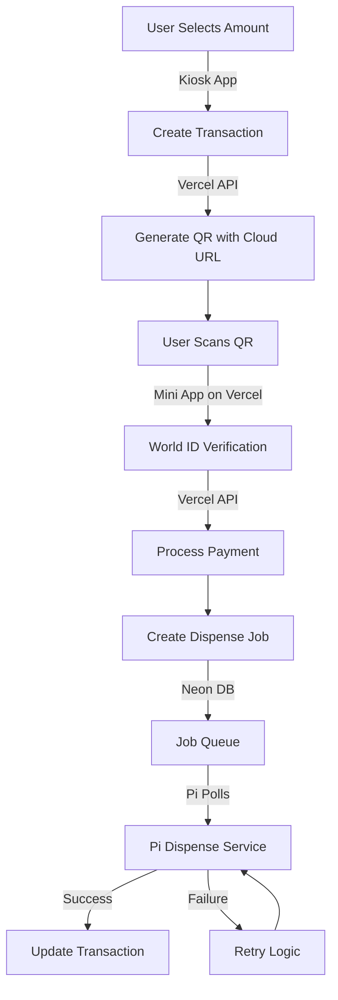

# 🚀 Enhanced RoluATM Transaction Processing Architecture

## Overview
Split the system into **Cloud Services** (reliable) and **Pi Services** (hardware-only) for maximum reliability.

## 🏗️ New Architecture

### **1. Cloud Backend (Vercel Functions)**
Handles all transaction logic EXCEPT physical dispensing:
- Transaction creation & management
- World ID verification
- Payment processing
- State persistence
- Retry orchestration

### **2. Pi Hardware Service**
ONLY handles hardware:
- Listening for dispense commands
- Executing T-Flex operations
- Reporting success/failure
- Auto-reconnect on network issues

### **3. State Synchronization**
- Cloud database (Neon) as single source of truth
- Pi polls for pending dispense jobs
- Automatic state recovery after Pi resets

## 📊 Transaction Flow 2.0



## 🔧 Implementation Details

### **1. Vercel API Routes** (`/api/v2/`)

```typescript
// /api/v2/transaction/create
export async function POST(req: Request) {
  // Create transaction in Neon DB
  // Return QR pointing to Vercel mini-app
  const transaction = await db.transaction.create({
    amount: req.body.amount,
    status: 'pending',
    expiresAt: new Date(Date.now() + 15 * 60 * 1000),
    kioskId: req.headers['x-kiosk-id'] // Track which Pi
  });
  
  return {
    id: transaction.id,
    qrUrl: `https://mini-app-azure.vercel.app/pay/${transaction.id}`,
    amount: transaction.amount
  };
}

// /api/v2/transaction/pay
export async function POST(req: Request) {
  // Verify World ID
  // Create dispense job
  // Return success immediately (async dispensing)
  
  const job = await db.dispenseJob.create({
    transactionId: req.body.transactionId,
    quarters: calculateQuarters(transaction.amount),
    kioskId: transaction.kioskId,
    status: 'pending',
    retryCount: 0,
    maxRetries: 3
  });
  
  return { status: 'payment_complete', jobId: job.id };
}

// /api/v2/jobs/pending
export async function GET(req: Request) {
  // Pi polls this endpoint
  const kioskId = req.headers['x-kiosk-id'];
  
  const jobs = await db.dispenseJob.findMany({
    where: {
      kioskId,
      status: 'pending',
      retryCount: { lt: db.raw('max_retries') }
    },
    orderBy: { createdAt: 'asc' },
    take: 1
  });
  
  return jobs[0] || null;
}
```

### **2. Enhanced Pi Service** (`pi_dispenser_service.py`)

```python
import time
import requests
from datetime import datetime, timedelta

class ResilientDispenserService:
    def __init__(self):
        self.kiosk_id = self.get_or_generate_kiosk_id()
        self.api_base = "https://rolu-api.vercel.app/api/v2"
        self.tflex = TFlexDispenser()
        self.last_job_id = None
        
    def get_or_generate_kiosk_id(self):
        """Persistent kiosk ID that survives reboots"""
        id_file = "/home/rahiim/.rolu_kiosk_id"
        if os.path.exists(id_file):
            with open(id_file, 'r') as f:
                return f.read().strip()
        else:
            kiosk_id = str(uuid.uuid4())
            with open(id_file, 'w') as f:
                f.write(kiosk_id)
            return kiosk_id
    
    def run_forever(self):
        """Main loop - polls for jobs and executes them"""
        while True:
            try:
                job = self.get_next_job()
                if job:
                    self.process_job(job)
                else:
                    time.sleep(2)  # No job, wait 2 seconds
            except Exception as e:
                logger.error(f"Service error: {e}")
                time.sleep(5)  # Error backoff
    
    def get_next_job(self):
        """Poll for pending dispense jobs"""
        try:
            response = requests.get(
                f"{self.api_base}/jobs/pending",
                headers={"x-kiosk-id": self.kiosk_id},
                timeout=5
            )
            if response.status_code == 200:
                return response.json()
            return None
        except:
            return None
    
    def process_job(self, job):
        """Execute dispense job with retry logic"""
        if job['id'] == self.last_job_id:
            # Duplicate job protection
            return
            
        self.last_job_id = job['id']
        
        try:
            # Dispense quarters
            success = self.tflex.dispense_quarters(job['quarters'])
            
            # Report result
            self.report_job_result(job['id'], success)
            
        except Exception as e:
            logger.error(f"Dispense error: {e}")
            self.report_job_result(job['id'], False, str(e))
    
    def report_job_result(self, job_id, success, error=None):
        """Report job completion status"""
        try:
            requests.post(
                f"{self.api_base}/jobs/{job_id}/complete",
                json={
                    "success": success,
                    "error": error,
                    "kioskId": self.kiosk_id,
                    "timestamp": datetime.utcnow().isoformat()
                },
                timeout=5
            )
        except:
            # Will retry on next poll
            pass
```

### **3. Kiosk App Updates** (`kiosk-app/src/pages/kiosk.tsx`)

```typescript
// Use Vercel API instead of local backend
const API_BASE = import.meta.env.VITE_VERCEL_API_URL || 'https://rolu-api.vercel.app/api/v2';

// Include kiosk ID in all requests
const kioskId = localStorage.getItem('kioskId') || generateKioskId();

const createTransactionMutation = useMutation({
  mutationFn: async (data: CreateTransactionRequest) => {
    const response = await fetch(`${API_BASE}/transaction/create`, {
      method: 'POST',
      headers: {
        'Content-Type': 'application/json',
        'x-kiosk-id': kioskId
      },
      body: JSON.stringify(data)
    });
    return response.json();
  }
});
```

### **4. Database Schema Enhancements**

```sql
-- Add dispense jobs table
CREATE TABLE dispense_jobs (
    id UUID PRIMARY KEY DEFAULT uuid_generate_v4(),
    transaction_id UUID REFERENCES transactions(id),
    kiosk_id UUID NOT NULL,
    quarters INTEGER NOT NULL,
    status VARCHAR(20) DEFAULT 'pending',
    retry_count INTEGER DEFAULT 0,
    max_retries INTEGER DEFAULT 3,
    last_attempt_at TIMESTAMP,
    completed_at TIMESTAMP,
    error_message TEXT,
    created_at TIMESTAMP DEFAULT NOW()
);

-- Add kiosk tracking
CREATE TABLE kiosks (
    id UUID PRIMARY KEY,
    name VARCHAR(255),
    location TEXT,
    last_seen_at TIMESTAMP,
    status VARCHAR(20),
    created_at TIMESTAMP DEFAULT NOW()
);

-- Indexes for performance
CREATE INDEX idx_dispense_jobs_pending ON dispense_jobs(kiosk_id, status) 
WHERE status = 'pending';
```

## 🛡️ Reliability Features

### **1. Automatic Recovery**
- Pi service auto-starts on boot
- Resumes pending jobs after restart
- No lost transactions during updates

### **2. Retry Mechanisms**
- Failed dispenses retry up to 3 times
- Exponential backoff between retries
- Manual intervention alerts after max retries

### **3. State Persistence**
- All state in cloud database
- Pi is stateless (except kiosk ID)
- Can rebuild Pi from scratch anytime

### **4. Network Resilience**
- Short timeout on API calls (5s)
- Automatic reconnection
- Offline queue for job results

### **5. Monitoring & Alerts**
```typescript
// Health check endpoint
app.get('/api/v2/health/:kioskId', async (req, res) => {
  const kiosk = await db.kiosk.findUnique({
    where: { id: req.params.kioskId }
  });
  
  const pendingJobs = await db.dispenseJob.count({
    where: { kioskId: req.params.kioskId, status: 'pending' }
  });
  
  const lastJob = await db.dispenseJob.findFirst({
    where: { kioskId: req.params.kioskId },
    orderBy: { createdAt: 'desc' }
  });
  
  return {
    kiosk: kiosk?.name || 'Unknown',
    lastSeen: kiosk?.lastSeenAt,
    pendingJobs,
    lastJobTime: lastJob?.createdAt,
    status: pendingJobs > 5 ? 'backlogged' : 'healthy'
  };
});
```

## 🚀 Deployment Strategy

### **Phase 1: Cloud Infrastructure**
1. Deploy Vercel functions
2. Setup Neon database with new schema
3. Test with mock Pi

### **Phase 2: Pi Service Update**
1. Deploy new dispenser service
2. Keep old backend running (fallback)
3. Gradual migration

### **Phase 3: Full Cutover**
1. Update kiosk app to use Vercel API
2. Disable old Pi backend
3. Monitor for 24 hours

## 📊 Success Metrics

1. **Transaction Success Rate**: Target 99.5%+
2. **Average Dispense Time**: < 5 seconds
3. **Recovery Time** (after Pi reset): < 30 seconds
4. **Retry Success Rate**: 95%+ on first retry

## 🎯 Benefits

1. **Pi resets don't lose transactions**
2. **Network issues auto-recover**
3. **Failed dispenses auto-retry**
4. **Cloud handles complex logic**
5. **Pi focuses on hardware only**
6. **Easy rollback if issues**
7. **Real-time monitoring**

This architecture ensures transactions succeed **almost always** by:
- Moving critical logic to reliable cloud
- Making Pi stateless and resilient
- Adding automatic recovery
- Implementing smart retry logic
- Providing clear monitoring

The system can now handle Pi reboots, network issues, and hardware failures gracefully! 